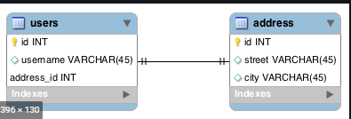
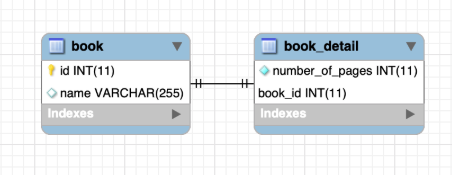
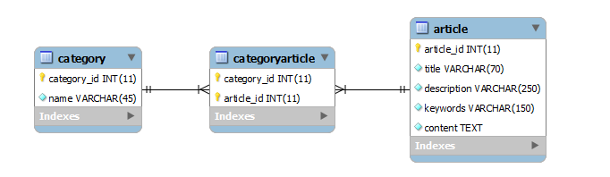

# Hibernate Tutorial

This project is created for hibernate object relation mapping through annotation. 

The simple hibernate application needs a lots of configurations file. so it's difficult to manage or understand. So,
Here I am using Spring Boot application to save developer time to create project, manage all dependency version and easy to handle or understand for beginners. To create project please use Spring Initializr or [start.spring.io](https://start.spring.io/).

**Add Dependency**

There are some dependency which is added in pom.xml file. Yes, I am using maven dependency, you can use as your comfort.

* Spring JPA 
* Spring devtools
* MySQL Database
* Lombok

Now we are going to learn object relational mapping one by one in details. Here we will see in short for recap or quick to understand of the all indexes. For more details follow the given separate tutorials in the same repository.

## Has-A Relation (Association)

When an entity contains another entity or entities as its member then Has-A relation is created between the containing and contained entities.

Has-A Relation can be of **4** types :-

1. One to one
2. One to many
3. Many to one
4. Many to many

**Note :** Each of these relation can be unidirectional or bidirectional

**Unidirectional Relation and Bidirectional Relation :**

In unidirectional relation, on the owner entity contain the reference of the owned entity. Where as in a bidirectional relation, both entities contains the reference of each other. Here I have used two new words Owner and Owned entity. let's understand.

### Understanding of owner entity and owned entity

In order to understand the mapping of a has-A relation, we must understand the responsibility of the owner and owned entities.

* In each has a relation one entity act as a owner and the other act as owned.

* If the relation is uniderectional, owner and owned has identity from the class but the relation is bidireactional then they only can be identity by the mapping.

**Following are the responsibility of the owner entity**

1. It needs to mapped its states

2. It needs to specify its relation with the owned entity.

3. It needs to specify, how this relation is mapped in the databases.

4. It needs to specify, which of its operation will be cascaded to the owned entity. 

**Following are the responsibility of the owned entity**

1. It needs to mapped its state, only if relation is uniderectional.

2. If the relation is bidireactional, It needs to specify its relation to the owner entity.

## One to one mapping

There are two ways to perform one to one mapping in hibernate:

1. By many-to-one element (using unique="true" attribute)
2. By one-to-one element

Here, we are going to perform one to one mapping by one-to-one relation. In such relation, we can be mapped in the following **3** three ways:

1. Same primary key value mapping.
2. Primary key - foreign key mapping.
3. Relation table mapping.

**Same primary key value mapping**

In this approach owner and owned entity table are mapped by using the same primary values in the realted records.

**Primary key - foreign key mapping**

In this approach, One to one relation of entity is mapped is using  by the primary key of owned entity table as the foreign key in ther owner entity table.

**Relation Table Mapping**

In this approach, the owner and owned entity table are linked with the help of the relation table which contains the primary key of both the tables as foreign keys.

