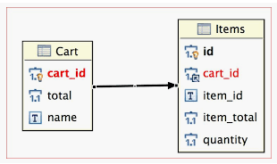

# One-To-Many Relationship

This quick Hibernate tutorial is created to understand a one-to-many mapping using JPA annotations. We'll also learn 
what are Unidirectional and Bidirectional relationships. We will see it by springBoot application. Let's setup first. 

**Add Dependency**

There are some dependency which is added in pom.xml file. Yes, I am using maven dependency, you can use as your comfort.

* Spring JPA
* MySQL Database
* Lombok

**application.yml**

Here I am using YAML file you can use as your comfort. MySQL and log configuration is mention in the application.yml file.

    spring:
      datasource:
        url: jdbc:mysql://localhost:3306/one-to-one?createDatabaseIfNotExist=true
        username: root
        password: root
      jpa:
        hibernate:
          ddl-auto: create
        show-sql: true
      
As you can see, here spring-web dependency is not present so I am using CommandLineRunner.

    @SpringBootApplication
    public class OneToManyApplication implements CommandLineRunner {
    
    	public static void main(String[] args) {
    		SpringApplication.run(OneToManyApplication.class, args);
    	}
    
    	@Override
    	public void run(String... args) throws Exception {
    		System.out.println("Setup One-to-many Object Relational mapping.");
    	}
    }
    
## One-To-Many Object Relational Mapping

One to many mapping means that one row in a table can be mapped to multiple rows in another table. 

**For example,**
   
Let's take a example, We want to implement Cart system for online shopping. So let's take two object Cart and Item. As 
you know, A cart can have multiple items so this is the good example for one-to-many mapping. 

Hibernate one to many mapping solutions

1. Hibernate one to many mapping with foreign key association
2. Hibernate one to many mapping with join table

### Hibernate one to many mapping with foreign key association
    
One-to-many mapping with foreign key association is a way to make relation between two table where one primary key row 
in a table can be mapped to multiple rows as foreign key in another table. Foreign key association can be unidirectional 
and bidirectional both.

#### Foreign key - Unidirectional

As you know, Unidirectional means we can operate all operation from owner side.
    
Let's create Item (owned) object first:

    @Entity
    public class Item {
    
        @Id
        @GeneratedValue(strategy = GenerationType.AUTO)
        @Column(name = "item_id")
        private Long itemId;
        private String name;
        private BigDecimal iteamTotal;
        private Integer quantity;
        
        // Constructor, setter and getter.
    }

Create Cart (Owner) Object first :

    @Entity
    public class Cart {
        @Id
        @GeneratedValue(strategy = GenerationType.AUTO)
        private Long id;
        private String name;
        private BigDecimal total;
    
        @OneToMany(cascade = CascadeType.ALL, targetEntity = Item.class, fetch = FetchType.EAGER)
        @JoinColumn(name = "cart_id", referencedColumnName = "id")
        private Set<Item> items;
        
        // Constructor, setter and getter.
    }

* **@OneToMany :** A one-to-many relationship between two entities is defined by using the @OneToMany annotation.
    * **cascade :** is optional and used to specify which entity operations should be cascaded to the associated entity
    * **fetch :** is optional and used to specify the strategy to fetch data from the database. By default fetching is lazy.
    * **targetEntity :** is optional and used to specify the target entity name.
    * **orphanRemoval = true :** The orphanRemoval feature can make it very comfortable to remove a child entity. You can use it for 
    parent-child relationships in which a child entity can’t exist without its parent entity.

* **@JoinColumn :** is used to specify the foreign key column in the underlying database table.
    * **name :** 
    * **referencedColumnName :** is defaulted to the primary key of the preferenced table.

> Optput

    // ----------------- CartForeignKeyService :: CrudOperation -----------------
    // ############ saveAllCart()  ############
    Hibernate: insert into cart (name, total) values (?, ?)
    Hibernate: select next_val as id_val from hibernate_sequence for update
    Hibernate: update hibernate_sequence set next_val= ? where next_val=?
    Hibernate: select next_val as id_val from hibernate_sequence for update
    Hibernate: update hibernate_sequence set next_val= ? where next_val=?
    Hibernate: insert into item (iteam_total, name, quantity, item_id) values (?, ?, ?, ?)
    Hibernate: insert into item (iteam_total, name, quantity, item_id) values (?, ?, ?, ?)
    Hibernate: insert into cart (name, total) values (?, ?)
    Hibernate: select next_val as id_val from hibernate_sequence for update
    Hibernate: update hibernate_sequence set next_val= ? where next_val=?
    Hibernate: select next_val as id_val from hibernate_sequence for update
    Hibernate: update hibernate_sequence set next_val= ? where next_val=?
    Hibernate: insert into item (iteam_total, name, quantity, item_id) values (?, ?, ?, ?)
    Hibernate: insert into item (iteam_total, name, quantity, item_id) values (?, ?, ?, ?)
    Hibernate: update item set cart_id=? where item_id=?
    Hibernate: update item set cart_id=? where item_id=?
    Hibernate: update item set cart_id=? where item_id=?
    Hibernate: update item set cart_id=? where item_id=?
    
    // ############ findCartById(1)  ############
    Hibernate: select cart0_.id as id1_0_0_, cart0_.name as name2_0_0_, cart0_.total as total3_0_0_, items1_.cart_id as cart_id5_1_1_, items1_.item_id as item_id1_1_1_, items1_.item_id as item_id1_1_2_, items1_.iteam_total as iteam_to2_1_2_, items1_.name as name3_1_2_, items1_.quantity as quantity4_1_2_ from cart cart0_ left outer join item items1_ on cart0_.id=items1_.cart_id where cart0_.id=?
    Cart{id=1, name='Books', total=18000.00, items=[Item{id=1, name='SCJP', iteamTotal=546.00, quantity=20}, Item{id=2, name='Design pattern', iteamTotal=236.00, quantity=30}]}
    
    // ############ deleteCartById(1)  ############
    Hibernate: select cart0_.id as id1_0_0_, cart0_.name as name2_0_0_, cart0_.total as total3_0_0_, items1_.cart_id as cart_id5_1_1_, items1_.item_id as item_id1_1_1_, items1_.item_id as item_id1_1_2_, items1_.iteam_total as iteam_to2_1_2_, items1_.name as name3_1_2_, items1_.quantity as quantity4_1_2_ from cart cart0_ left outer join item items1_ on cart0_.id=items1_.cart_id where cart0_.id=?
    2020-05-08 14:14:05.188  INFO 12296 --- [  restartedMain] c.h.o.foreign_key.CartForeignKeyService  : Cart{id=1, name='Books', total=18000.00, items=[Item{id=2, name='Design pattern', iteamTotal=236.00, quantity=30}, Item{id=1, name='SCJP', iteamTotal=546.00, quantity=20}]}
    Hibernate: update item set cart_id=null where cart_id=?
    Hibernate: delete from item where item_id=?
    Hibernate: delete from item where item_id=?
    Hibernate: delete from cart where id=?
    
    // ############ findAllCart()  ############
    Hibernate: select cart0_.id as id1_0_, cart0_.name as name2_0_, cart0_.total as total3_0_ from cart cart0_
    Hibernate: select items0_.cart_id as cart_id5_1_0_, items0_.item_id as item_id1_1_0_, items0_.item_id as item_id1_1_1_, items0_.iteam_total as iteam_to2_1_1_, items0_.name as name3_1_1_, items0_.quantity as quantity4_1_1_ from item items0_ where items0_.cart_id=?
    Cart{id=2, name='Electronic', total=161276.00, items=[Item{id=4, name='Laptop', iteamTotal=43546.00, quantity=1}, Item{id=3, name='Phone', iteamTotal=23546.00, quantity=5}]}

  