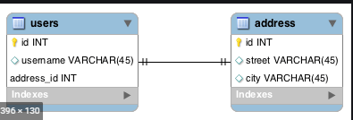
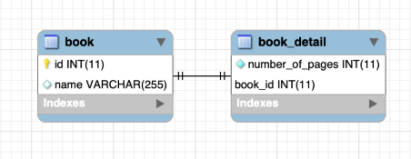
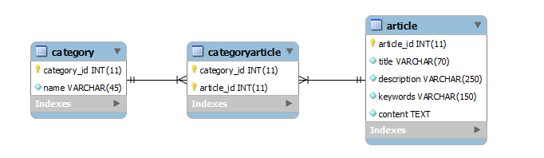

# One-To-One relationship

This project is created for hibernate object relation mapping through annotation. We can learn one to one object relationship using Annotation in this project.
The one-to-one jpa annotation is used to map the source entity with the target entity.

**Add Dependency**

There are some dependency which is added in pom.xml file. Yes, I am using maven dependency, you can use as your comfort.

* Spring JPA 
* MySQL Database
* Lombok

**application.yml**

Here I am using YAML file you can use as your comfort. MySQL and log configuration is mention in the application.yml file.

    spring:
      datasource:
        url: jdbc:mysql://localhost:3306/one-to-one?createDatabaseIfNotExist=true
        username: root
        password: root
      jpa:
        hibernate:
          ddl-auto: create
        show-sql: true  

As you can see, I am not using spring-web dependency so I am using CommandLineRunner.

    @SpringBootApplication
    public class OneToOneApplication implements CommandLineRunner {
    
    	public static void main(String[] args) {
    		SpringApplication.run(OneToOneApplication.class, args);
    	}
    
    	@Override
    	public void run(String... args) throws Exception {
    		System.out.println("We can get output from here");
    	}
    }

### Object Relation Mapping

We will discuss three different type of mapping supported by hibernate, which is given below: 

1. Same primary key
2. Foreign key
3. Join table.  

### Same primary key

In this approach owner and owned entity table are mapped by using the same primary values in the realted records.

#### Same primary key - Unidirectional

In this approach, Hibernate will insure that it will use a common primary key value in both the table. because of 
unidirectional, we will be able to get only address from user side.

> User class

    @Entity
    public class User {
        @Id
        @GeneratedValue(generator= "custom_foreigngen")
        private Long id;
        private String username, password;
        
        @OneToOne(cascade = CascadeType.ALL)
        @PrimaryKeyJoinColumn
        private Address address;
        
    }        
 
**@GeneratedValue(generator= "custom_foreigngen"):-** generatior will create custom table to manage id.

**@OneToOne :-** this annotation is used to map one to one relationship.

**Cascade :-** Cascase is used to give permision to perform operation type on both Table.

**@PrimaryKeyJoinColumn :-** PrimaryKeyJoinColumn is used to create same primary key in owned class which is already used in Owner class.

> Address class

    @Entity
    public class Address {
        @Id
        @GeneratedValue
        private Long id;
        private String state;
    }
    
If you want to save User and address below code will there:

    User user = new User("Vikash", "singh", new Address("Delhi"));
    userDao.save(user);   // userDao is JPARepository of User class.
    
After run this application below query will be perform by hibernate:

> Create table structure :

    Hibernate: create table address (id bigint not null, state varchar(255), primary key (id)) engine=InnoDB
    Hibernate: create table custom_foreigngen (next_val bigint) engine=InnoDB
    Hibernate: insert into custom_foreigngen values ( 1 )
    Hibernate: create table hibernate_sequence (next_val bigint) engine=InnoDB
    Hibernate: insert into hibernate_sequence values ( 1 )   
    Hibernate: create table user (id bigint not null, password varchar(255), username varchar(255), primary key (id)) engine=InnoDB

> Insert data into tables :

    Hibernate: select next_val as id_val from custom_foreigngen for update
    Hibernate: update custom_foreigngen set next_val= ? where next_val=?
    Hibernate: select next_val as id_val from hibernate_sequence for update
    Hibernate: update hibernate_sequence set next_val= ? where next_val=?
    Hibernate: insert into address (state, id) values (?, ?)
    Hibernate: insert into user (password, username, id) values (?, ?, ?)
    
> Output

As log of the console, if you are going to find user then hibernate will get address as well because there are a relation 
between user and address which is given below :   

    // hibernate log
    Hibernate: select user0_.id as id1_1_0_, user0_.password as password2_1_0_, user0_.username as username3_1_0_ from user user0_ where user0_.id=?
    Hibernate: select address0_.id as id1_0_0_, address0_.state as state2_0_0_ from address address0_ where address0_.id=?
    
    // find user by id
    User(id=1, username=Vikash, password=singh, address=Address(id=1, state=Delhi))
    
But if you find address then user will not come as given below because there are not relation from Address to User object. I mean, 
there is only one Unidirectional mapping so need to map bidirectional as well.

     Hibernate: select address0_.id as id1_0_0_, address0_.state as state2_0_0_ from address address0_ where address0_.id=?
     Address : Address(id=2, state=Noida)
     
#### Same primary key - Bidirectional

The term bidirectional literally means functioning in two directions,  it means that we are able to access Object A 
from Object B, and Object B from Object A. and we will able to operate all operation from both side. Till now, We are able 
to get address object from user side but Address is unknown that associated from which User.

For access User from Address following annotation needs to integrate:

    @Entity
    public class Address {
        @Id
        @GeneratedValue
        private Long id;
        private String state;
    
        @OneToOne(mappedBy = "address", cascade = CascadeType.ALL)
        private User user;
    }  
  
Need to understand *@OneToOne(mappedBy = "address", cascade = CascadeType.ALL).* 

**@OneToOne :** @OneToOne annotation is need to mark on User type property in Address object. 

**mappedBy :** The value of mappedBy is the name of the association-mapping attribute on the owning side.  
mappedBy attribute are always put(annotated) on the inverse side of relationship. 

**cascade :** Cascade is mapped for which type of operation wants to operate from Address side.

**Note :** If cascade is not mentioning here, It will not give all permission to operate all operations from 
bidirectional like delete. 

> Output

    // Hibernate log
    Hibernate: select address0_.id as id1_0_0_, address0_.state as state2_0_0_, user1_.id as id1_1_1_, user1_.password as password2_1_1_, user1_.username as username3_1_1_ from address address0_ left outer join user user1_ on address0_.id=user1_.id where address0_.id=?
    // Address Object log
    Address : Address{id=2, state='Noida'}, User : User{id=2, username='Anil', password='gupta'}
    
    LOGGER.info("########## saveAddress() ##########");
    // We can't operate save operation from owned side

### Foreign key

Hibernate one-to-one mapping with foreign key association. In this type of association, a foreign key column is created 
in owner entity. 

This is an example of a one-to-one relationship, in this case between Book and Book_details entities.

#### Implementing with a Foreign Key - Unidirectional

First, let's create the Book class and annotate it appropriately:

    @Entity
    public class Book {
        @Id
        @GeneratedValue(strategy = GenerationType.IDENTITY)
        private Long id;
        private String name;
        @OneToOne(cascade = CascadeType.ALL)
        @JoinColumn(name = "bookDetails_id")
        private BookDetail bookDetail;
        
        // getter, setter and contructor
     }
 
The Book_detail entity create as simple Pojo class:

    @Entity
    @Table(name = "book_detail")
    public class BookDetail {
        @Id
        @GeneratedValue
        private Long id;
        private int numberOfPages;
        
        // Setter, getter and Constructor
    }
    
**@OneToOne :** Defines a one-to-one relationship between 2 entities.

**cascade :** Cascade is mapped for which type of operation wants to operate from Address side.

**@JoinColumn :** defines foreign key column and indicates the owner of the relationship.

**unique = true :** enforces the unique constraint, 1 book belongs to only 1 bookDetails object. If value of unique is 
true then *many-to-one* works like *one-to-one* and *many-to-many* works like *one-to-many*
    
> Output

    // ########### Save() ###########  
    Hibernate: insert into book_detail (number_of_pages) values (?)
    Hibernate: insert into book (book_details_id, name) values (?, ?)
    
    // ########### FindBookById() ###########
    Hibernate: select book0_.id as id1_1_0_, book0_.book_details_id as book_det3_1_0_, book0_.name as name2_1_0_, bookdetail1_.detail_id as detail_i1_2_1_, bookdetail1_.number_of_pages as number_o2_2_1_ from book book0_ left outer join book_detail bookdetail1_ on book0_.book_details_id=bookdetail1_.detail_id where book0_.id=?
    Book{id=1, name='SCJP', bookDetail=BookDetail{id=1, numberOfPages=870}}
    
    // ########### delete() ###########
    Hibernate: select book0_.id as id1_1_0_, book0_.book_details_id as book_det3_1_0_, book0_.name as name2_1_0_, bookdetail1_.detail_id as detail_i1_2_1_, bookdetail1_.number_of_pages as number_o2_2_1_ from book book0_ left outer join book_detail bookdetail1_ on book0_.book_details_id=bookdetail1_.detail_id where book0_.id=?
    Book{id=2, name='K.C.SINHA', bookDetail=BookDetail{id=2, numberOfPages=435}}
    Hibernate: delete from book where id=?
    Hibernate: delete from book_detail where detail_id=?

#### Implementing with a Foreign Key - Bidirectional

Just should be mentioned of relation on the only owned entity like given blow of bookDetails entity:

    @Entity
    @Table(name = "book_detail")
    public class BookDetail {
    
        @Id
        @GeneratedValue(strategy = GenerationType.IDENTITY)
        @Column(name = "detail_id")
        private Long id;
        private int numberOfPages;
    
        // name of mappedBy (bookDetails) is same as properties of BookDetails Object which is present in Book Object
        @OneToOne(mappedBy = "bookDetail", cascade = CascadeType.ALL)
        private Book book; 
        
        // Construcotor, Getter and Setter.
    } 
    
**mappedBy :** mappedBy indicates the inverse of the relationship.

**cascade :** Cascade is mapped for which type of operation wants to operate from BookDetails entity side.

**Note :** If cascade is not mentioning here, It will not give all permission to operate all operations from 
bidirectional like delete. 

if the name of id column is different then need to mention on the owner side as well.

    @Entity
    public class Book {
    
        @Id
        @GeneratedValue(strategy = GenerationType.IDENTITY)
        private Long id;
        private String name;
        @OneToOne(cascade = CascadeType.ALL)
        @JoinColumn(name = "details_id", unique = true)
        private BookDetail bookDetail;
        
        // Constructor, Getter and Setter.
    }

**@OneToOne :** Defines a one-to-one relationship between 2 entities.

**cascade :** Cascade is mapped for which type of operation wants to operate from  BookDetails entity  side.

**unique = true :** enforces the unique constraint, 1 book belongs to only 1 bookDetails object. If value of unique is 
true then *many-to-one* works like *one-to-one* and *many-to-many* works like *one-to-many*

**Note :** name of mappedBy (bookDetails) is same as properties name of BookDetails Object which is present in Book Object

> Output 

    // ########## FindById(1) ##########
    Hibernate: select bookdetail0_.detail_id as detail_i1_2_0_, bookdetail0_.number_of_pages as number_o2_2_0_, book1_.id as id1_1_1_, book1_.details_id as details_3_1_1_, book1_.name as name2_1_1_ from book_detail bookdetail0_ left outer join book book1_ on bookdetail0_.detail_id=book1_.details_id where bookdetail0_.detail_id=?
    BookDetail{id=1, numberOfPages=870}, Book{id=1, name='SCJP', bookDetail=BookDetail{id=1, numberOfPages=870}}
    
    LOGGER.info("########## saveBookDetail() ##########");
    // We can't operate save operation from owned side
    
    // ########## delete(1) ##########
    BookDetail{id=1, numberOfPages=870}, Book{id=1, name='SCJP', bookDetail=BookDetail{id=1, numberOfPages=870}}
    Hibernate: select bookdetail0_.detail_id as detail_i1_2_0_, bookdetail0_.number_of_pages as number_o2_2_0_, book1_.id as id1_1_1_, book1_.details_id as details_3_1_1_, book1_.name as name2_1_1_ from book_detail bookdetail0_ left outer join book book1_ on bookdetail0_.detail_id=book1_.details_id where bookdetail0_.detail_id=?
    Hibernate: delete from book where id=?
    Hibernate: delete from book_detail where detail_id=?
    
    //  ########## FindAll() ##########
    Hibernate: select bookdetail0_.detail_id as detail_i1_2_, bookdetail0_.number_of_pages as number_o2_2_ from book_detail bookdetail0_
    Hibernate: select book0_.id as id1_1_1_, book0_.details_id as details_3_1_1_, book0_.name as name2_1_1_, bookdetail1_.detail_id as detail_i1_2_0_, bookdetail1_.number_of_pages as number_o2_2_0_ from book book0_ left outer join book_detail bookdetail1_ on book0_.details_id=bookdetail1_.detail_id where book0_.details_id=?
    BookDetail{id=3, numberOfPages=435}, Book{id=3, name='STUDENT FRIENDS', bookDetail=BookDetail{id=3, numberOfPages=435}}

### Join table

Join table is also known as **Relation Entity mapping**. In this approach, we will see that the owner and owned entity table are linked with the help of the relation table which contains the primary key of both the tables as foreign keys.

Here we will take the example of *Category and Article* entities. The primary key of both tables will be linked with the help of the relation table that is *CategoryArtical*. As you can see the given picture below : 

#### Implementing with a Join table - Unidirectional

First, let's create the *Category* class and annotate it appropriately:

    @Entity
    public class Category {
    
        @Id
        @GeneratedValue(strategy = GenerationType.IDENTITY)
        private Long id;
        private String name;
    
        @OneToOne(cascade = CascadeType.ALL)
        @JoinTable(name = "category_article",
                    joinColumns = {
                            @JoinColumn(name = "category_id_FK", referencedColumnName = "id", nullable = false)
                    },
                    inverseJoinColumns = {
                            @JoinColumn(name = "artical_id_FK", referencedColumnName = "id", unique = true, nullable = false)
                    }
        )
        private Article article;
       
        // Constructor, Setter and Getter
    }    

**@JoinTable :** JoinTable annotation is mark for create the relation table where the primary key of both tables will 
be linked as foreign key. 
* **name** indecate the relation table name.
* **joinColumns** joinColumns need to specify for customize column name of owner entity in relation table. It's optional.
    * **JoinColumn - name :** Name can be anything which you want to customize join column name of owner entity 
    in relation table  
    * **JoinColumn - referencedColumnName :** referencedColumnName should be same as owner entity primary key. It's 
    optional, main purpose of the *referencedColumnName* is to specify which primary column name to make foreign key. 
    * **nullable :** by default nullable value is true. if you don't want to insert nullable value then you can specify 
    nullable = false
    
* **inverseJoinColumns** inverseJoinColumns need to specify for customize column name of owned entity in relation table.
It's optional.
    * **JoinColumn - name :** Name can be anything which you want to customize join column name of owned entity 
        in relation table  
    * **JoinColumn - referencedColumnName :** referencedColumnName should be same as owned entity primary key. It's 
    optional, main purpose of the *referencedColumnName* is to specify which primary column name to make foreign key.
    * **unique = true :** enforces the unique constraint, 1 book belongs to only 1 bookDetails object. If value of unique is 
      true then *many-to-one* works like *one-to-one* and *many-to-many* works like *one-to-many*
    * **nullable :** by default nullable value is true. if you don't want to insert nullable value then you can specify 
        nullable = false

The *Article* entity create as simple POJO class:

    @Entity
    public class Article {
        @Id
        @GeneratedValue(strategy = GenerationType.IDENTITY)
        private long id;
        private String title, discreption;
        
        // Constructor, Setter and Getter
    }   

> Output

    // ---------- Article :: crudOperation ----------
    // ########## saveAll() ##########
    Hibernate: insert into article (discreption, title) values (?, ?)
    Hibernate: insert into category (name) values (?)
    Hibernate: insert into category_article (article_id, id) values (?, ?)
    Hibernate: insert into article (discreption, title) values (?, ?)
    Hibernate: insert into category (name) values (?)
    Hibernate: insert into category_article (article_id, id) values (?, ?)
    Hibernate: insert into article (discreption, title) values (?, ?)
    Hibernate: insert into category (name) values (?)
    Hibernate: insert into category_article (article_id, id) values (?, ?)
    Hibernate: insert into article (discreption, title) values (?, ?)
    Hibernate: insert into category (name) values (?)
    Hibernate: insert into category_article (article_id, id) values (?, ?)
    
    // ########## findCategoryById(1) ##########
    Hibernate: select category0_.id as id1_4_0_, category0_.name as name2_4_0_, category0_1_.article_id as article_1_5_0_, article1_.id as id1_1_1_, article1_.discreption as discrept2_1_1_, article1_.title as title3_1_1_ from category category0_ left outer join category_article category0_1_ on category0_.id=category0_1_.id left outer join article article1_ on category0_1_.article_id=article1_.id where category0_.id=?
    // Category{id=1, name='name_1', article=Article{id=1, title='title_1', discreption='discreption_1'}}
    
    // ########## deleteCategory(1) ##########
    Hibernate: select category0_.id as id1_4_0_, category0_.name as name2_4_0_, category0_1_.article_id as article_1_5_0_, article1_.id as id1_1_1_, article1_.discreption as discrept2_1_1_, article1_.title as title3_1_1_ from category category0_ left outer join category_article category0_1_ on category0_.id=category0_1_.id left outer join article article1_ on category0_1_.article_id=article1_.id where category0_.id=?
    Category{id=1, name='name_1', article=Article{id=1, title='title_1', discreption='discreption_1'}}
    Hibernate: select category0_.id as id1_4_0_, category0_.name as name2_4_0_, category0_1_.article_id as article_1_5_0_, article1_.id as id1_1_1_, article1_.discreption as discrept2_1_1_, article1_.title as title3_1_1_ from category category0_ left outer join category_article category0_1_ on category0_.id=category0_1_.id left outer join article article1_ on category0_1_.article_id=article1_.id where category0_.id=?
    Hibernate: delete from category_article where id=?
    Hibernate: delete from category where id=?
    Hibernate: delete from article where id=?
    
    // ########## findAllCategory(1) ##########
    Hibernate: select category0_.id as id1_4_, category0_.name as name2_4_, category0_1_.article_id as article_1_5_ from category category0_ left outer join category_article category0_1_ on category0_.id=category0_1_.id
    Hibernate: select article0_.id as id1_1_0_, article0_.discreption as discrept2_1_0_, article0_.title as title3_1_0_ from article article0_ where article0_.id=?
    Hibernate: select article0_.id as id1_1_0_, article0_.discreption as discrept2_1_0_, article0_.title as title3_1_0_ from article article0_ where article0_.id=?
    Hibernate: select article0_.id as id1_1_0_, article0_.discreption as discrept2_1_0_, article0_.title as title3_1_0_ from article article0_ where article0_.id=?
    Category{id=2, name='name_2', article=Article{id=2, title='title_2', discreption='discreption_2'}}
    Category{id=3, name='name_3', article=Article{id=3, title='title_3', discreption='discreption_3'}}
    Category{id=4, name='name_4', article=Article{id=4, title='title_4', discreption='discreption_4'}} 
    
#### Implementing with a Join table - Bidirectional

We need to mappedBy only from owned entity side. So should be change only Article entity. Let's change:

    @Entity
    public class Article {
        @Id
        @GeneratedValue(strategy = GenerationType.IDENTITY)
        private long id;
        private String title, discreption;
    
        @OneToOne(mappedBy = "article", cascade = CascadeType.ALL)
        private Category category;
        
        // constructor, setter and getter. 
    }
    
**@OneToOne :-** this annotation is used to map one to one relationship.

**mappedBy :** The value of mappedBy is the name of the association-mapping attribute on the owning side.  
mappedBy attribute are always put(annotated) on the inverse side of relationship.

**Cascade :-** Cascase is used to give permision to perform operation type on both Table.

> Output 

    // ---------- Article :: crudOperation ----------
    
    LOGGER.info("########## saveAritcle() ##########");
    // We can't operate save operation from owned side
    
    // ########## findAritcleById(4) ##########
    Hibernate: select article0_.id as id1_1_0_, article0_.discreption as discrept2_1_0_, article0_.title as title3_1_0_, article0_1_.category_id_fk as category0_5_0_, category1_.id as id1_4_1_, category1_.name as name2_4_1_, category1_1_.artical_id_fk as artical_1_5_1_, article2_.id as id1_1_2_, article2_.discreption as discrept2_1_2_, article2_.title as title3_1_2_, article2_1_.category_id_fk as category0_5_2_ from article article0_ left outer join category_article article0_1_ on article0_.id=article0_1_.artical_id_fk left outer join category category1_ on article0_1_.category_id_fk=category1_.id left outer join category_article category1_1_ on category1_.id=category1_1_.category_id_fk left outer join article article2_ on category1_1_.artical_id_fk=article2_.id left outer join category_article article2_1_ on article2_.id=article2_1_.artical_id_fk where article0_.id=?
    Article{id=4, title='title_4', discreption='discreption_4', category=Category{id=4, name='name_4'}}
    
    // ########## deleteAritcleById(4) ##########
    Hibernate: select article0_.id as id1_1_0_, article0_.discreption as discrept2_1_0_, article0_.title as title3_1_0_, article0_1_.category_id_fk as category0_5_0_, category1_.id as id1_4_1_, category1_.name as name2_4_1_, category1_1_.artical_id_fk as artical_1_5_1_, article2_.id as id1_1_2_, article2_.discreption as discrept2_1_2_, article2_.title as title3_1_2_, article2_1_.category_id_fk as category0_5_2_ from article article0_ left outer join category_article article0_1_ on article0_.id=article0_1_.artical_id_fk left outer join category category1_ on article0_1_.category_id_fk=category1_.id left outer join category_article category1_1_ on category1_.id=category1_1_.category_id_fk left outer join article article2_ on category1_1_.artical_id_fk=article2_.id left outer join category_article article2_1_ on article2_.id=article2_1_.artical_id_fk where article0_.id=?
    Article{id=4, title='title_4', discreption='discreption_4', category=Category{id=4, name='name_4'}}
    Hibernate: delete from category_article where category_id_fk=?
    Hibernate: delete from article where id=?
    Hibernate: delete from category_article where category_id_fk=?
    Hibernate: delete from category where id=?
    
    // ########## findAllAritcle() ##########
    Hibernate: select article0_.id as id1_1_, article0_.discreption as discrept2_1_, article0_.title as title3_1_, article0_1_.category_id_fk as category0_5_ from article article0_ left outer join category_article article0_1_ on article0_.id=article0_1_.artical_id_fk
    Hibernate: select category0_.id as id1_4_0_, category0_.name as name2_4_0_, category0_1_.artical_id_fk as artical_1_5_0_, article1_.id as id1_1_1_, article1_.discreption as discrept2_1_1_, article1_.title as title3_1_1_, article1_1_.category_id_fk as category0_5_1_, category2_.id as id1_4_2_, category2_.name as name2_4_2_, category2_1_.artical_id_fk as artical_1_5_2_ from category category0_ left outer join category_article category0_1_ on category0_.id=category0_1_.category_id_fk left outer join article article1_ on category0_1_.artical_id_fk=article1_.id left outer join category_article article1_1_ on article1_.id=article1_1_.artical_id_fk left outer join category category2_ on article1_1_.category_id_fk=category2_.id left outer join category_article category2_1_ on category2_.id=category2_1_.category_id_fk where category0_.id=?
    Hibernate: select category0_.id as id1_4_0_, category0_.name as name2_4_0_, category0_1_.artical_id_fk as artical_1_5_0_, article1_.id as id1_1_1_, article1_.discreption as discrept2_1_1_, article1_.title as title3_1_1_, article1_1_.category_id_fk as category0_5_1_, category2_.id as id1_4_2_, category2_.name as name2_4_2_, category2_1_.artical_id_fk as artical_1_5_2_ from category category0_ left outer join category_article category0_1_ on category0_.id=category0_1_.category_id_fk left outer join article article1_ on category0_1_.artical_id_fk=article1_.id left outer join category_article article1_1_ on article1_.id=article1_1_.artical_id_fk left outer join category category2_ on article1_1_.category_id_fk=category2_.id left outer join category_article category2_1_ on category2_.id=category2_1_.category_id_fk where category0_.id=?
    Article{id=2, title='title_2', discreption='discreption_2', category=Category{id=2, name='name_2'}}
    Article{id=3, title='title_3', discreption='discreption_3', category=Category{id=3, name='name_3'}}

